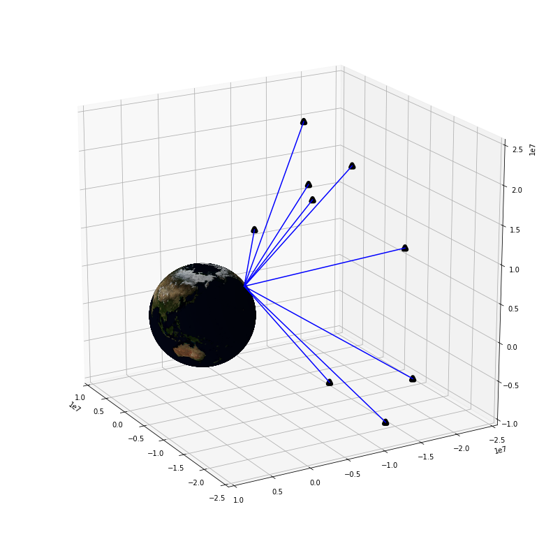
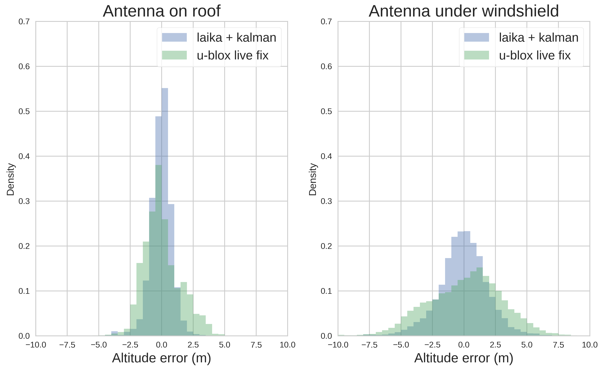

# Laika

Laika is an open-source GNSS processing library. Laika is similar projects like [RTKlib](https://github.com/tomojitakasu/RTKLIB) and [GPSTK](https://github.com/SGL-UT/GPSTk), but in Python and with a strong focus on readibility, usibility and easy integration with other optimizers. Laika can process raw GNSS observations with data gathered online from various analysis groups to produce data ready for position/velocity estimation. Laika is designed to produce accurate results whilst still being readable easy to use. Laika is the perfect tool to develop accurate GNSS-only or GNSS-fusion localisation algorithms.




## The GNSS problem

GNSS satellites orbit the earth broadcasting signals that allow the receiver to determine the distance to each satellite. These satellites have known orbits and so their positions are known. This makes determining the receiver's position a basic 3-dimensional [trilateration](https://en.wikipedia.org/wiki/Trilateration) problem. In practice observed distances to each satellite will be measured with some offset that is caused by the receiver's clock error. This offset also needs to be determined, making it a 4-dimensional trilateration problem. 


Since this problem is generally overdetermined (more than 4 satellites to solve the 4d problem) there is a variety of methods to compute a position estimate from the measurements. Laika provides a basic [weighted least squares](https://en.wikipedia.org/wiki/Weighted_least_squares) solver for experimental purposes. This is far from optimal due to the dynamic nature of the system, this makes a bayesian estimator like a [Kalman filter](https://en.wikipedia.org/wiki/Kalman_filter) the preferred estimator.

However, the above description is over-simplified. Getting accurate distance estimates to satellites and the satellite's position from the receiver observations is not trivial. This is what we call processing of the GNSS observables and it is this procedure laika is designed to make easy.


## Astrodog
Astrodog is the main component of the laika. It is a python object, and like the [soviet space dogs](https://en.wikipedia.org/wiki/Soviet_space_dogs) to which it owes it's name, an astrodog will do everything in its power to make the life of its master easier. Which in this case is fetch and process all the neccesary data to transform raw GNSS observables into useable distance measurements and satellite positions ready for position estimation.

#### Satellite info
Astrodog has a get_sat_info function that will provide an accurate position, velocity and clock error for any satellite at any time in history. 


#### Pseudorange corrections
Astrodog has a get_delay function that will provide a pseudorange delay correction for any satellite at any time in history for the requested receiver position. This delay correction includes a correction for the tropospheric signal delay, ionospehric signal delay and differential code biases (DCBs) of the transmitting satellite.

This delay can either be estimated with mathematical models or with [DGPS station](https://www.ngs.noaa.gov/CORS/) observations, which is more accurate, but slower and only supported in the continental United States.

#### Architecture
GNSS processing requires getting data from the internet from various analysis groups such as NASA's [CDDIS](https://cddis.nasa.gov/Data_and_Derived_Products/GNSS/GNSS_data_and_product_archive.html). AstroDog downloads files from FTP servers from these groups when it needs them. Downloading and parsing all this data can be slow. AstroDog caches all downloaded files locally to avoid redownloading. 

These files are then parsed by AstroDog and kept in memory. Every one of these parsed objects (DCBs, ionospheric models, satellite orbit polynomials, etc...) has a valid location area and/or a valid time window.  Within those windows these objects can provide information relevant to GNSS processing.


## Design principles of laika
- Should work without configuration or setup
- Nothing is worth compromising accuracy for
- It is preferable to return no solution than a degraded solution


## Laika's accuracy
To confirm the quality of Laika's GNSS processing, we ran laika's processing and a simple kalman filter (procedure described in examples) on 2000 minutes of driving of a regular commute in San Francisco. The data comes from a "u-blox M8" chip. The fixes computed with laika's processed data are compared to the live navigation fixes given by the u-blox chip. They compared by looking at the standard deviation of all measured altitudes within every 5x5m square in the dataset. There is no way to compare horizontal accuracy without ground truth, but there is no reason to believe that vertical and horizontal accuracy are not equally correlated for laika computed positions and ublox's live positions. Data with the antenna on the roof and antenna inside the car are compared separately, since the results are significantly different. 



## Examples
- A comprehensive walkthrough of the main functions of AstroDog and other useful laika functions
- Computation of a Continuously Operating Reference Station (CORS) position with laika
- Using laika with a kalman filter to get more accurate position fixes from a GPS module

## Installation
Laika runs in python 2.x, and has only been tested on ubuntu 16.04. Running in a virtualenv is reccomended.

#### laika
If you do not yet have numpy and scipy installed. Install them with pip. Having accelerated numpy will make laika much faster.
```
pip install numpy scipy
```
Then laika can be installed with
```
python setup.py install
```
The tests should now pass.

#### notebook examples
The notebook examples require some visualisation packages. To install them first you need
```
sudo apt-get install libfreetype6-dev
```
and then with pip
```
pip install -r requirements_examples.txt --user
```
Then you should be able to run the notebooks. The notebooks can be opened by running `jupyter notebook` and then navigating to the desired .ipynb file.

## Useful GNSS references
- [Comphrensive handbook of all things GNSS](https://www.springer.com/us/book/9783319429267)

- [Consice clear explanations of most concepts](https://gssc.esa.int/navipedia/index.php/Main_Page)
